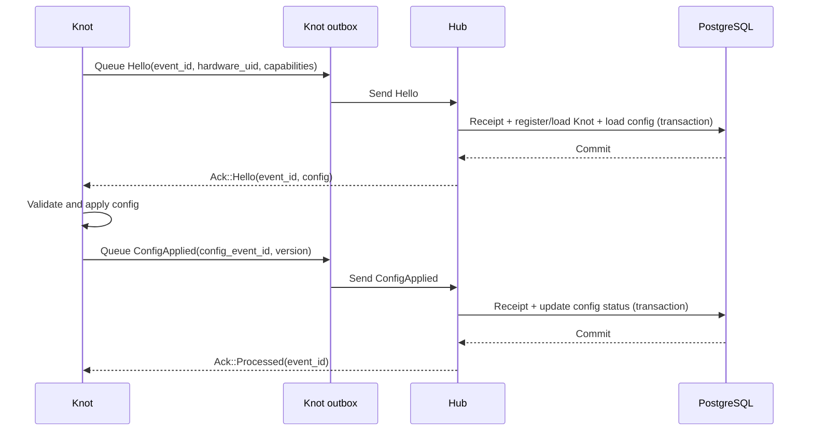

# Event Messaging

ArkSync uses one bilateral protocol between a Hub and a Knot, regardless of whether the Knot runs in the Hub process or on remote embedded hardware. The protocol is independent from Tokio, Embassy, MQTT, LoRa, Zenoh, and PostgreSQL.

The current delivery model is **at least once**. PostgreSQL remains the durable source of truth for station state. ArkSync stores message processing receipts for idempotence, but it does not use event sourcing.

## Responsibilities

Messaging is split across four boundaries:

- `arksync-bus` owns generic event envelopes, identifiers, Postcard helpers, and synchronous in-process routing.
- `arksync-knot-protocol` owns the versioned wire contract shared by Hubs and Knots.
- `arksync-knot` owns the portable Knot protocol state machine, its bounded outbox, and runtime-specific link adapters.
- `arksync-hub` owns message processing, transaction boundaries, durable receipts, and local or remote link orchestration.

Sensor and actuator crates keep their internal application messages. Explicit mappers at the Knot and Hub boundaries prevent an internal refactor from silently changing the wire representation.

## Envelope And Frame

Every protocol message is carried by a `KnotEnvelope`, which contains:

- an `EventId` used for correlation and idempotence;
- a source identifying the Hub or the Knot;
- the time at which the event occurred;
- a `KnotMessage` payload.

The wire frame starts with the ArkSync magic bytes and a protocol version, followed by a Postcard-encoded envelope. Datagram transports can carry this frame directly. Stream transports add their own length delimiter outside the ArkSync frame.

Protocol enum variants are append-only within a version because Postcard encodes their discriminants. An incompatible representation requires a new protocol version and updated golden-frame tests.

## Handshake And Configuration

A new Knot announces its stable hardware UID in `Hello`. The Hub registers unknown hardware by default and returns the current configuration in `Ack::Hello`. The configuration contains the logical Knot ID, sensor bindings, actuator configuration, and a monotonically increasing version.

The Hub can later send `Configure` without restarting the handshake. The Knot answers with `ConfigApplied` or `ConfigRejected`; both responses correlate the configuration message through its `EventId`.

## Sensor Messages

Sensor discovery, provisioning conflicts, provisioning, and measurements use `KnotSensorMessage`. Measurements are batched at the protocol level even though the current UART runtime emits one measurement per batch.

The Hub records a processing receipt and all business effects in one database transaction. It sends `Ack::Processed` only after the transaction commits. Receiving the same `EventId` again produces another ACK without duplicating sensor registration or measurements.

## Retry And Failure Semantics

Messages that require confirmation remain in the Knot's bounded in-memory outbox. The default policy is:

- 256 pending messages;
- one second before the first retry;
- exponential backoff capped at 30 seconds;
- no retry limit.

A retry preserves the original envelope and `EventId`. A corrected or logically new message receives a new `EventId`. Transport failures and Hub infrastructure failures produce no ACK, so the normal retry schedule applies.

A retryable NACK reschedules the same message immediately. A terminal NACK removes it from the outbox. Outbox exhaustion is explicit and observable rather than silently dropping a message.

The V1 outbox is volatile and does not survive an embedded-device reboot. Flash-backed persistence is a future extension.

## Router, Link, And Transport

These concepts have separate roles:

- `EventRouter` performs synchronous fan-out inside one process. It filters borrowed envelopes, invokes every matching handler, and reports successful and rejected deliveries.
- `MessageLink` is an asynchronous point-to-point port used by runtime adapters. Its send and receive operations expose link failure without defining a runtime or transport.
- A transport adapter moves complete protocol frames. MQTT, LoRa, Zenoh, or another transport must not redefine the messages.

The current Raspberry Pi runtime uses a pair of bounded Tokio endpoints for its in-process Hub/Knot link. Tests also exercise the same contract over TCP with Postcard framing and reconnection. A future ESP32 runtime will drive the portable state machine with its embedded executor and transport adapter.

Actuator execution still has a clearly named legacy local channel while its messages are migrated to the versioned protocol. This compatibility path is temporary and does not define the future wire contract.
