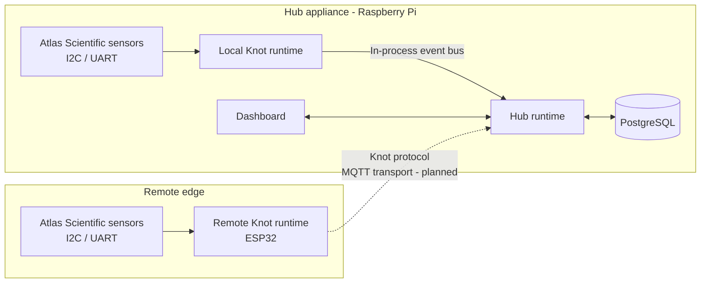

# Architecture Overview

ArkSync separates station coordination from direct hardware access. The Hub owns persistent station state and user-facing workflows, while Knots execute close to sensors and actuators.

The following diagram shows the intended high-level topology. The local Knot path is used by the current Raspberry Pi deployment. MQTT is the planned transport for remote embedded Knots; it will carry the same Knot protocol messages rather than redefine them.

## Knot

The Knot owns portable protocol messages and hardware-facing execution. Its reusable domain and runtime contracts are `no_std` first. Platform adapters provide concrete scheduling, transport, sensor, and actuator integrations:

- the Raspberry Pi Hub uses a Tokio-backed local Knot runtime;
- a remote ESP32 Knot will use an embedded runtime and MQTT transport;
- both paths preserve the same protocol-level messages.

## Hub

The Hub is the station coordination boundary. It receives Knot messages, applies application workflows, persists station state, and supplies the dashboard. The Hub is a host runtime and may use Tokio, SQLx, and operating-system services.

On a standalone Raspberry Pi deployment, the Hub also launches a local Knot. This gives directly connected I2C, UART, and GPIO hardware the same logical boundary as hardware attached to a future remote Knot.

## PostgreSQL

PostgreSQL is the Hub's persistent source of truth. It stores station identities, registered hardware, measurements, dashboard configuration, actuator configuration, and other durable state. Runtime caches and event streams may improve responsiveness, but they do not replace persisted state.

## Dashboard

The dashboard is the user-facing projection of Hub state. It obtains persisted measurements and configuration through Hub application workflows and can later consume realtime updates without becoming responsible for hardware communication or domain rules.
